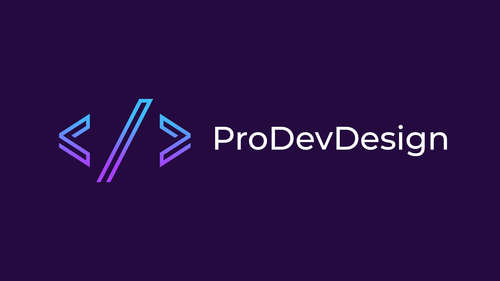

## <h1 align="center">Hi 👋, I'm Kacper</h1>
<h3 align="center">A front end developer from Poland</h3>

And welcome to my profile on github :)

  

  

 ## 

  
  <ul align="left">
 <li>🔭 I’m currently working on ProDevDesign - portfolio website (<a href="https://prodevdesign.github.io/">LINK</a>)</li>
 
<li>🌱 I’m currently learning <strong>Javascript</strong></li>
 
<li>👨‍💻 All of my projects will be available at <a href="https://prodevdesign.github.io/">ProDevDesign</a></li>
</ul>
  
<h3 align="left">Connect with me:</h3>

  

    

  

  
 
<h1>Skills</h1>

<h3 align="left">Front-end Development</h3>

   <a href="https://getbootstrap.com" target="_blank" rel="noreferrer">  <a href="https://mdbootstrap.com/" target="_blank" rel="noreferrer">  

  
  
<h3 align="left">Software</h3> 
  

 <a href="https://code.visualstudio.com/" target="_blank" rel="noreferrer">  &nbsp </a>      

  
<h3 align="left">OS</h3> 
 
 
   

 
 <h1>Future learning plans</h1>
 
 
    
 
